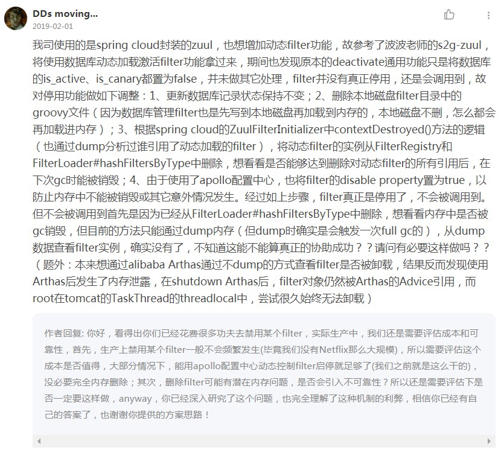

# trust-freedom定制版Spring Cloud Netflix Zuul，主要新增功能：动态添加/删除Filter

> Spring Boot版本： 1.5.18.RELEASE
>
> Spring Cloud版本： Dalston.SR5


## Quick Start

### 启动前修改配置

**1、启动Eureka**

此项目需要连接到Eureka，请提前启动单机版Eureka

<br>

**2、建表**

使用 `resources/db/schema.sql` 建表

<br>

**3、修改配置文件**

修改 [application.properties](https://github.com/trust-freedom/trust-freedom-spring-cloud-netflix-zuul/blob/master/trust-freedom-spring-cloud-netflix-zuul/src/main/resources/application.properties) 中关于 **Filter存放路径** 和 **数据库连接** 的配置，如

```properties
# 将“绝对路径”修改为本地磁盘路径
# 也可以将以下path完整替换为本地的某个绝对路径，此路径是用于存储本地已加载Filter的
zuul.filter.pre.path = 绝对路径/trust-freedom-spring-cloud-netflix-zuul/src/main/groovy/filters/pre
zuul.filter.route.path = 绝对路径/trust-freedom-spring-cloud-netflix-zuul/src/main/groovy/filters/route
zuul.filter.post.path = 绝对路径/trust-freedom-spring-cloud-netflix-zuul/src/main/groovy/filters/post
zuul.filter.error.path = 绝对路径/trust-freedom-spring-cloud-netflix-zuul/src/main/groovy/filters/error
## zuul.filter.custom.path =


# 填写自己的数据库连接信息
# 建表语句在 resources/db/schema.sql
zuul.data-source.class-name = com.mysql.jdbc.Driver
zuul.data-source.url = mysql数据库url
zuul.data-source.user = 数据库user
zuul.data-source.password = 数据库password
zuul.data-source.min-pool-size = 10
zuul.data-source.max-pool-size = 20
```

<br>

### 启动Application

使用`com.freedom.springcloud.zuul.TrustFreeDomZuulApplication`启动

<br>

### 访问管理页面

正常启动后，访问： http://localhost:9041/admin/filterLoader.jsp


<br>

### 测试Groovy脚本

在 [test-scripts](https://github.com/trust-freedom/trust-freedom-spring-cloud-netflix-zuul/tree/master/trust-freedom-spring-cloud-netflix-zuul/test-scripts)目录下有几个前缀过滤器Pre的测试脚本，可以直接上传

<br>

## 改进

### 1、调整初始化ZuulFilterDao时机

原本通过`ZuulDynamicFilterInitializerConfiguration`配置类@Bean创建`FilterScriptManagerServlet`这个管理页面相关的Servlet时会一并初始化`ZuulFilterDao`，但由于此时archaius读取不到spring env中的配置信息，初始化`ZuulFilterDao`会报错，故将初始化`ZuulFilterDao`的时机改为初次使用时

<br>

### 2、增加动态卸载/移除filter功能

原本的deactivate停用功能只是将数据库的is_active、is_canary都置为false，并未做其它处理，filter并没有真正停用，还是会调用到，故对停用功能做如下调整：

1. 更新数据库记录状态保持不变（只更新当前filter_id 和 version）
2. 删除本地磁盘filter目录中的groovy文件（因为数据库管理filter也是先写到本地磁盘再加载到内存的，本地磁盘不删，怎么都会再加载进内存）
3. 根据spring cloud的ZuulFilterInitializer中contextDestroyed()方法的逻辑（也通过dump分析过谁引用了动态加载的filter），将动态filter的实例从FilterRegistry和FilterLoader#hashFiltersByType中删除，想看看是否能够达到删除对动态filter的所有引用后，在下次gc时能被销毁
4. 由于使用了apollo配置中心，也将filter的disable property置为true，以防止内存中不能被销毁或其它意外情况发生（只有当前filter既没有激活版，又没有金丝雀版时，才更新disable property为true，一旦触发灰度或启用动作，就要更新disable property为false）

<br>

经过如上步骤，filter真正是停用了，不会被调用到。但不会被调用到首先是因为已经从FilterLoader#hashFiltersByType中删除，想看看内存中是否被gc销毁，但目前的方法只能通过dump内存（但dump时确实是会触发一次full gc的），从dump数据查看filter实例，确实没有了，不知道这能不能算真正的协助成功？？请问有必要这样做吗？？

（题外：本来想通过alibaba Arthas通过不dump的方式查看filter是否被卸载，结果反而发现使用Arthas后发生了内存泄露，在shutdown Arthas后，filter对象仍然被Arthas的Advice引用，而root在tomcat的TaskThread的threadlocal中，尝试很久始终无法卸载）

<br>

**[波波老师回复](https://time.geekbang.org/course/detail/84-10581)**



<br>

## 参考

[Spring2go定制版Netflix zuul](https://github.com/spring2go/s2g-zuul)